# NLP Kinopoisk's movies reviews 

Анализ ML моделей в задаче классификации отзывов 

## Модели

- **Логистическая регрессия**
- **Случайный лес**
- **XGBoost**
- **Линейный метод опорных векторов (LinearSVC)**

## Технологический стек
-   **Язык программирования**: Python 3.11
-   **Библиотеки**: NumPy, NLTK, Matplotlib, Seaborn, Scikit-learn, xgboost, pymorphy3, gensim, Pandas

## Данные
Общий размер датасета: 131669
| positive | neutral | negative |
|-----------|-----------|-----------|
| 87138  | 24704  | 19827  |

### График распределения классов 
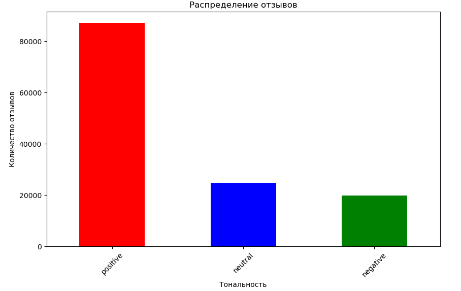
## Результаты

### Стемминг и TF-IDF
Обработка текста (фильтрация, токенизация, стемминг, TF-IDF)
#### **Логистическая регрессия**

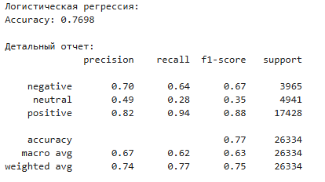
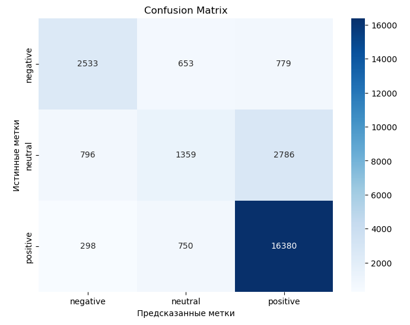
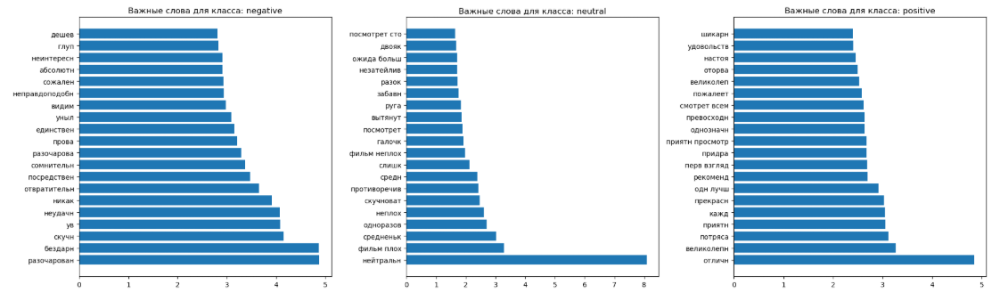

#### **Сбалансированная логистическая регрессия**

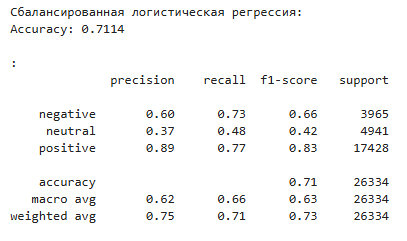
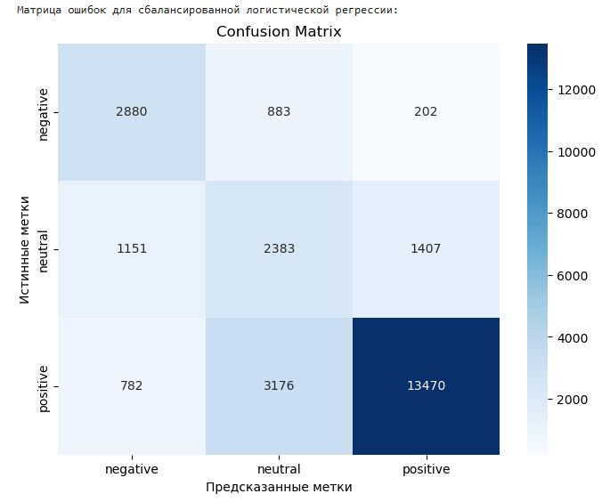
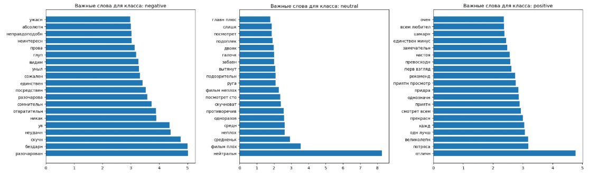

#### **Случайный лес**

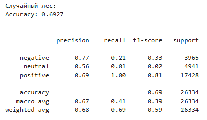
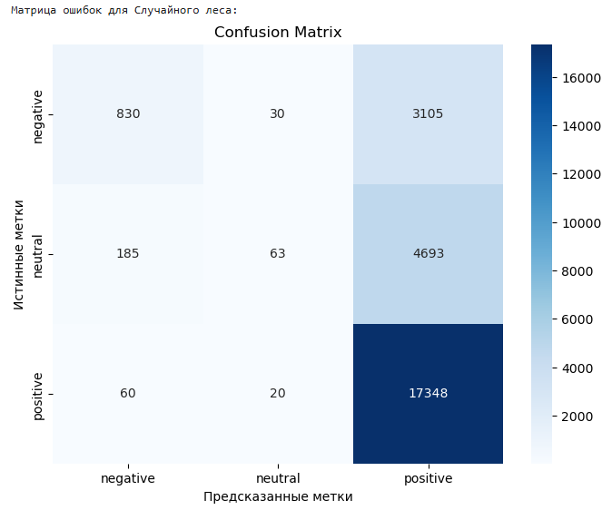
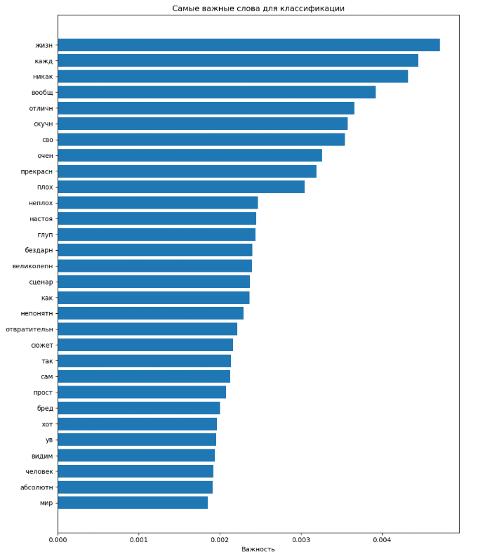

#### **XGBoost**

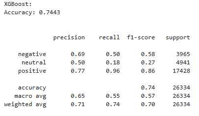
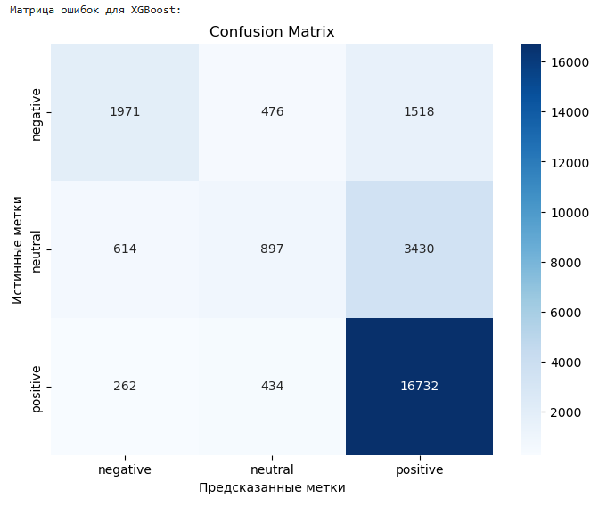
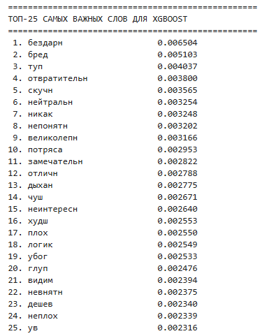

### Лемматизация и TF-IDF
Обработка текста (фильтрация, токенизация, лемматизация, TF-IDF)

#### **Сбалансированная логистическая регрессия**

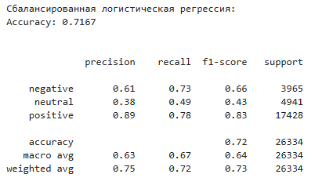
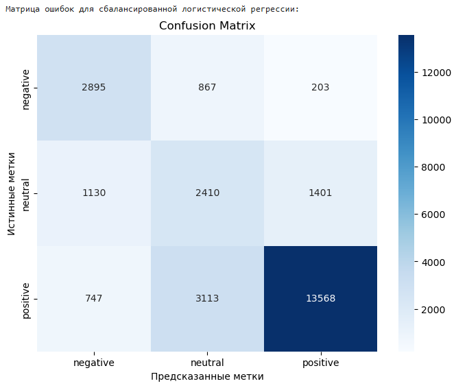
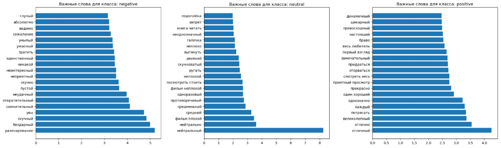

#### **Линейный метод опорных векторов (LinearSVC)**

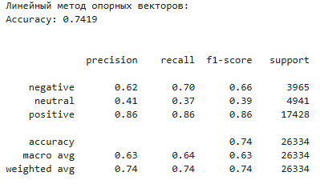
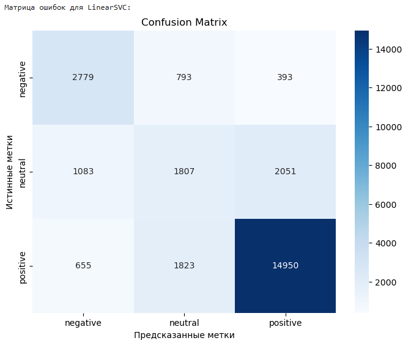
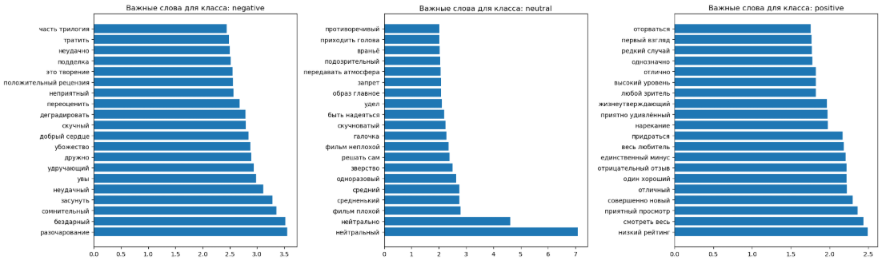

### Лемматизация и Word2Vec

#### **Сбалансированная логистическая регрессия**

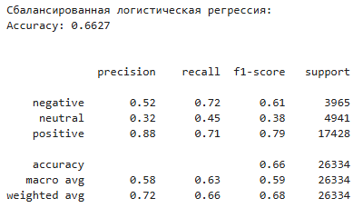
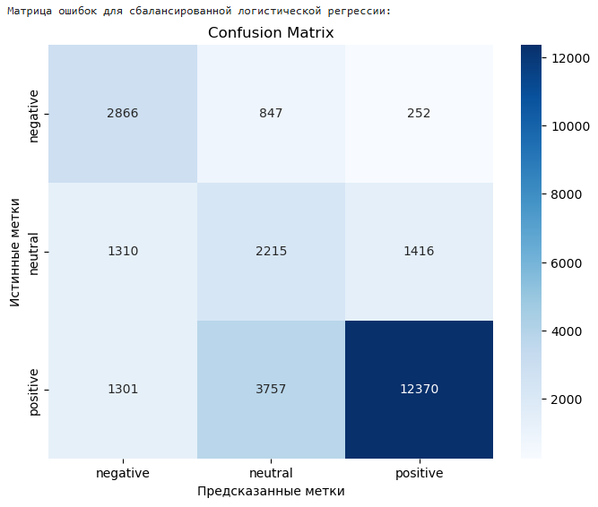
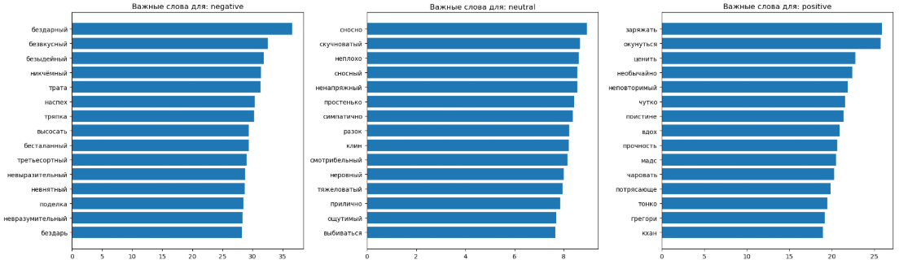

